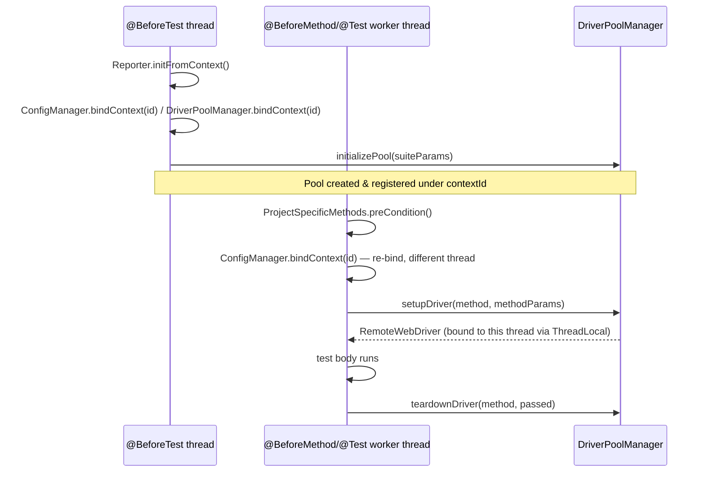
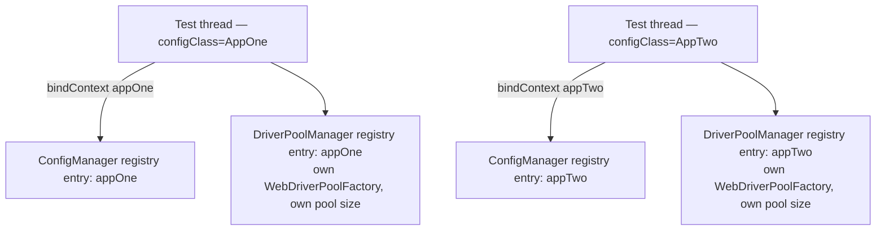

# autoFrameX Architecture

Diagrams and structural reference produced by the enterprise architecture review
(2026-07-14/15). Companion documents: [TECHNICAL_DEBT_REGISTER.md](TECHNICAL_DEBT_REGISTER.md),
[ARCHITECTURE_REVIEW_ROADMAP.md](ARCHITECTURE_REVIEW_ROADMAP.md),
[CODING_STANDARDS.md](CODING_STANDARDS.md).

> Diagrams use [Mermaid](https://mermaid.js.org/) — they render natively on GitHub/GitLab.

---

## High-level architecture

Boxes are packages; arrows are real `import` dependencies observed in source, not the
intended layering the names suggest. `design.patterns.*` was meant to be the innermost,
most generic layer, but it imports back out to `com.framework.config.data` in several
places — the opposite of what Clean/Onion architecture expects.

```mermaid
graph TB
    subgraph api["com.api.*"]
        A1["REST client / schema layer"]
    end

    subgraph fw["com.framework.* (testng · selenium · cucumber · observability · security · performance · utils)"]
        F1["Test-execution & cross-cutting framework layer<br/>consumed directly by every project team's test classes"]
    end

    subgraph infra["design.patterns.* (object.pool · factory.browser · database.*)"]
        I1["Intended as generic, framework-agnostic infrastructure primitives"]
    end

    subgraph cfg["com.framework.config.data"]
        C1["ConfigManager / ProjectDirector / ConfigResolver<br/>context-keyed registry (fixed 2026-07-15 — was a JVM singleton)"]
    end

    fw -->|extends / uses| infra
    infra -.->|"still imports back (PoolConfig, DriverPoolManager, BrowserFactory, DBManager)"| cfg
    fw --> cfg
    api --> fw

    style infra fill:#3a2020,stroke:#c0392b
    style cfg fill:#203a2a,stroke:#2f6650
```



**Status:** the `infra → cfg` back-reference (dashed arrow above) is still open — fixing it
means `WebDriverPoolFactory`/`DriverPoolManager`/`BrowserFactory`/`DBManager` accepting
plain value objects instead of reaching into `ConfigManager` themselves. Tracked as
open work in the roadmap; the config/pool singleton itself (the more urgent half of this
problem) was fixed in the 2026-07-15 pass.

---

## Package dependency cycle (fixed)

This exact cycle existed until 2026-07-15 and blocked any future multi-module Maven
split (a cycle across module boundaries won't compile).

```mermaid
graph LR
    U["com.framework.utils<br/>(Reporter, TestMetadata, AccountData)"]
    T["testng.api.base<br/>(ProjectSpecificMethods)"]
    S["selenium.api.base<br/>(SeleniumBase)"]

    U -.->|"Reporter imported TestMetadata<br/>(REMOVED — moved to utils)"| T
    T -->|extends| S
    S -->|"extends Reporter"| U

    style U fill:#203a2a,stroke:#2f6650
```



**Status: fixed.** `TestMetadata` and `AccountData` were moved from
`com.framework.testng.api.base` into `com.framework.utils` (alongside `Reporter` and
`DataLibrary`, their respective primary consumers). `com.framework.utils` no longer
imports anything from `com.framework.testng.api.base` — verified via
`grep -rn "import com.framework.testng.api.base" src/main/java/com/framework/utils/`
returning nothing.

---

## Class inheritance chain (God-class check)

Every consumer still inherits the full public surface of `Reporter`/`SeleniumBase` —
that inheritance relationship is unchanged and intentionally preserved (this is a
shared library with external consumers not visible in this repo). What changed
2026-07-15 (TD-07) is what's *behind* that surface: `SeleniumBase`'s ~85 methods used
to contain their logic directly; now each one is a one-line delegation to a focused
action object.

```mermaid
graph TB
    R["Reporter<br/>~587 lines · abstract"]
    SB["SeleniumBase<br/>thin facade · delegates to 11 action classes"]
    PSM["ProjectSpecificMethods"]
    CPB["CucumberProjectBase"]
    ACT["com.framework.selenium.api.actions<br/>ClickActions, TypeActions, WaitActions,
AlertActions, ScreenshotActions, WindowFrameActions,
NavigationActions, JsActions, FileUploadActions,
LocatorActions, ElementInspectionActions"]

    R --> SB
    SB --> PSM
    SB --> CPB
    SB -.composes.-> ACT

    style ACT fill:#1e3a2a,stroke:#2ecc71
```



**Status: fixed (2026-07-15, TD-07).** "Extract class + delegate," not an inheritance
change: `SeleniumBase` keeps every existing public method signature (still
`extends Reporter implements Browser, Element`), so `ProjectSpecificMethods`/
`CucumberProjectBase`/`BasePage`/any external `extends SeleniumBase` consumer needed
zero changes. A consumer that only needs one narrow capability can now also compose a
single action class directly (e.g. just `ClickActions`) instead of inheriting the full
~85-method surface — proven by a standalone test
(`StandaloneActionComposabilityTest`) that uses `ClickActions` with no `SeleniumBase`
and no TestNG lifecycle involved. `Reporter`'s TestNG lifecycle hooks stay on
`Reporter` itself (TestNG requires `@Before*`/`@After*` on the actual extended class or
a registered listener); its `ExtentReports`/folder-management portion was extracted
into `ExtentReportManager`. See the Technical Debt Register's TD-07 entry and the
roadmap's Phase 2 for the full design.

---

## Per-test lifecycle sequence

TestNG's guaranteed ordering across the base classes. Both `ConfigManager` and
`DriverPoolManager` bind the calling thread to its config/pool context at **both**
`@BeforeTest` and `@BeforeMethod` — not just once — because `parallel="methods"`/
`"classes"` run test methods on different worker threads than the one that ran
`@BeforeTest`.



---

## Plugin architecture — closed vs. open extension points

```mermaid
graph TB
    subgraph open["Open — ProjectAppConfiguration"]
        O1["interface + configClass XML param"]
        O2["Owner @Config.Sources MERGE"]
        O3["one property file per project team"]
        O4["No fork needed"]
    end

    subgraph custom["Partially open — BrowserType.CUSTOM (added 2026-07-15)"]
        B1["BrowserRegistry.registerCustom(Browser)"]
        B2["One custom Browser implementation, no enum fork"]
        B3["Limitation: only one custom browser at a time —<br/>BrowserType is still the pool's Map key"]
    end

    subgraph partial["Partially open — SeleniumBase (TD-07, 2026-07-15)"]
        S1["Full inheritance chain unchanged — still requires extends SeleniumBase"]
        S2["But: com.framework.selenium.api.actions classes<br/>(ClickActions, WaitActions, ...) can be composed standalone"]
        S3["Embedding into an existing corporate base class still<br/>requires forking SeleniumBase itself — not solved by TD-07"]
    end

    style open fill:#10251c,stroke:#2f6650
    style custom fill:#262008,stroke:#7a5e00
    style partial fill:#262008,stroke:#7a5e00
```



**Status:** config-class extension was already open. `BrowserType.CUSTOM` +
`BrowserRegistry` (2026-07-15) opens one custom-browser slot without forking the enum —
verified end-to-end with a registered custom `Browser` implementation launching
correctly. Supporting **multiple** independently-pooled custom browsers would require
reworking `WebDriverPoolFactory`'s Map-keying from the enum to a general identifier —
open, larger work, tracked next after TD-07. `SeleniumBase`'s internal composition
(TD-07) now lets a consumer use one narrow action class without inheriting the full
surface, but the base-class `extends` relationship itself is unchanged by design (see
the God-class section above) — embedding autoFrameX into an existing corporate base
class still requires forking `SeleniumBase`, which TD-07 deliberately did not attempt
(would break the public extension contract for unseen external consumers).

---

## Configuration resolution flow

The one real Chain-of-Responsibility in the codebase. Until 2026-07-15 it was
implemented **twice** — once in `ProjectDirector`, once in `DriverPoolManager` — with
subtly different behavior (one gave up on a parse failure, the other fell through to
the next tier). Both now delegate to a single `ConfigResolver`.

```mermaid
graph LR
    A["TestNG/Cucumber<br/>parameter"] --> B["Env variable"]
    B --> C["-D system property<br/>(same key as param)"]
    C --> D["Caller-supplied<br/>default"]

    style A fill:#123138,stroke:#1F6F7A
```



A tier whose value fails to parse is logged and skipped in favor of the next tier,
rather than immediately returning the default — a malformed higher-priority override
no longer shadows a valid lower-priority one. Both `ProjectDirector` and
`DriverPoolManager.loadConfiguration()` delegate to `com.framework.config.data.ConfigResolver`.

---

## Project structure (multi-module split — TD-20, fully done 2026-07-15)

Broke the original single flat module (one `artifactId`, ~21 direct dependencies, all
transitive to every consumer) along the seams visible in the package tree, into a real
8-module reactor. See
[TECHNICAL_DEBT_REGISTER.md](TECHNICAL_DEBT_REGISTER.md)'s TD-20 entry for the full
3-stage history (prerequisite decoupling, module migration, CI/Docker/Jenkins/docs).

```text
autoframex/  (reactor pom, packaging=pom, holds <dependencyManagement> —
              no separate BOM module was needed)
├── autoframex-core/           config.data, utils(.logging), observability, exception (leaf — no deps)
├── autoframex-selenium/       selenium.api.*, testng.api.base, design.patterns.object.pool,
│                               factory.browser, plus the 5 Selenium-dependent utils classes
│                               (WaitUtils, ScreenshotUtils, ScreenshotStore, ValidationUtils,
│                               VideoRecorder)                                    [depends on: core]
├── autoframex-api/            com.api.design (ApiClient/ResponseAPI — needs RestAssured directly,
│                               so it couldn't live in core), com.api.rest.assured.base
│                                                                                 [depends on: core]
├── autoframex-database/       design.patterns.database.*                        [depends on: core]
├── autoframex-cucumber/       cucumber.api.base, BDD glue conventions   [depends on: core, selenium, api]
├── autoframex-performance/    performance.* (opt-in test-code isolation) [depends on: core, selenium, api]
├── autoframex-security/       security.* — SecurityTestBase extends selenium's
│                               ProjectSpecificMethods, so needs selenium too, not just core+api
│                                                                          [depends on: core, selenium, api]
└── autoframex-testkit/        the one suite spanning every module's classpath at once (testng.xml)
                                                                            [depends on: all of the above]
```

**Corrected 2026-07-15** (research during TD-20 planning): the original version of this
diagram said performance/security modules exist to "pull JMeter/ZAP-client deps only
here" — that was wrong. Neither a JMeter dependency nor a ZAP-client dependency exists
anywhere in the pom: `ApiPerformanceUtils` uses only Java stdlib + RestAssured, and
`ZapSecurityUtils` drives ZAP's own daemon entirely over its REST API via RestAssured.
Splitting these out is still worth doing — it keeps performance/security *test code* out
of projects that don't want it, matching the review's per-concern module boundary — just
not for the dependency-weight reason previously claimed here.

## Multi-context config/pool registry (implemented 2026-07-15)

`ConfigManager` and `DriverPoolManager` were converted from JVM-wide singletons into a
registry keyed by `contextId` (defaults to the resolved `configClass`), so two
applications can now run concurrently in one JVM without one's config silently merging
into the other's.



Verified with a real two-`<test>` parallel suite: distinct `ConfigManager`/
`DriverPoolManager` identity hashes and independent pool stats (`Created=1` each, not
`Created=2`) when run concurrently. `getInstance()` kept its original signature
everywhere — the ~33 existing call sites (`BasePage`, `WaitUtils`, `BrowserFactory`,
`RemoteGridBrowser`, `PoolConfig`, `RetryEngine`) needed zero changes.
